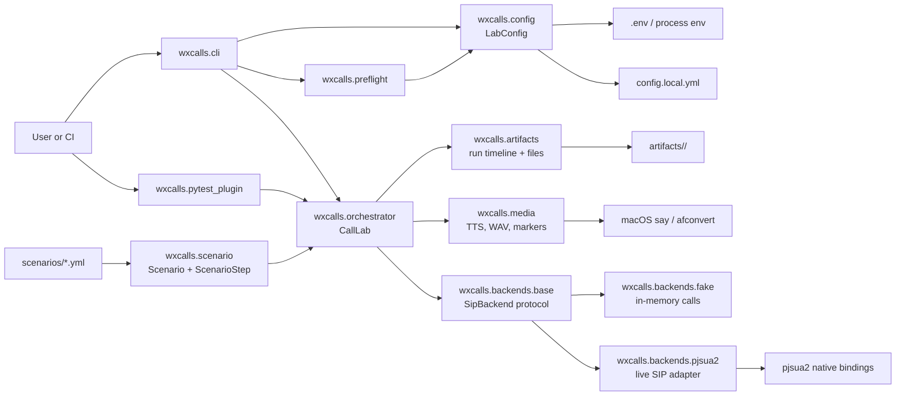

# Architecture

`wxcalls` is a Python scenario-test framework prototype for Webex Calling generic SIP phones. It turns YAML configuration and YAML call-flow scenarios into backend-neutral scenario execution. The same orchestration layer can run against a deterministic fake backend for local tests or a live PJSUA2 backend for SIP registration, calls, media, and video smoke probes.

## System Overview

The package has one main runtime path:

1. A CLI command or pytest collection option selects a config file, scenario file, and backend.
2. `wxcalls.config` loads clients, targets, artifacts settings, DNS settings, and local secret values.
3. `wxcalls.scenario` validates scenario YAML into typed steps.
4. `wxcalls.orchestrator.CallLab` initializes the chosen backend, executes each scenario step, prepares media, checks recordings, and records timeline artifacts.
5. A backend implementation performs the SIP/media behavior, either in memory with `FakeSipBackend` or through native PJSUA2 bindings with `Pjsua2SipBackend`.

## Dependency Direction

The architecture is centered on `CallLab`. Entry points depend on it, and it depends on the stable backend protocol plus support modules. Scenario parsing and config loading do not depend on the backends, which keeps validation cheap and testable. The live PJSUA2 binding is imported lazily inside `Pjsua2SipBackend.initialize()`, so fake runs and unit tests do not require native PJSIP installation.

## Runtime Modules

| Module | Purpose | Internal dependencies | External dependencies |
| --- | --- | --- | --- |
| `wxcalls.__init__` | Defines the public package exports for callers that import the framework as a library. | `config`, `orchestrator`, `scenario` | None beyond imported modules. |
| `wxcalls.__main__` | Supports `python -m wxcalls` by delegating to the CLI entry point. | `cli` | None. |
| `wxcalls.cli` | Provides the `wxcalls` command with `preflight` and `run` subcommands. It parses CLI options, runs preflight diagnostics, and executes scenario files inside an initialized lab. | `orchestrator`, `preflight` | Python `argparse`, `asyncio`. |
| `wxcalls.pytest_plugin` | Registers pytest options, collects selected YAML scenario files as pytest items, and exposes fixtures for configured labs, clients, targets, and scenario execution. | `orchestrator` | `pytest`, Python `glob`, `asyncio`. |
| `wxcalls.config` | Loads framework YAML and dotenv-style secrets into immutable dataclasses. It validates client/target shape, resolves credential environment variables, and resolves scenario target names to SIP URIs. | `exceptions` | `PyYAML`, process environment. |
| `wxcalls.scenario` | Defines the YAML scenario schema, validates step actions, endpoint behaviors, and required fields, and returns typed scenario data. | `exceptions` | `PyYAML`. |
| `wxcalls.behavior` | Runs optional endpoint behavior policies beside explicit scenario steps. It watches incoming calls, call state, media activation, and timers, then dispatches scoped behavior actions back through `CallLab`. | `backends.base`, `config`, `exceptions`, `scenario` | Python `asyncio`. |
| `wxcalls.orchestrator` | Coordinates scenario execution. `CallLab` owns the loaded config, backend, artifact writer, media factory, call handles, recordings, and optional behavior runtime. Each scenario action maps to a `_step_*` handler. | `artifacts`, `behavior`, `backends.base`, `backends.fake`, `backends.pjsua2`, `config`, `exceptions`, `media`, `scenario` | Python `asyncio` via async context management. |
| `wxcalls.backends.base` | Defines backend-neutral call data and the `SipBackend` protocol used by the orchestrator. This is the contract for backend implementations. | `config` | Python `typing.Protocol`. |
| `wxcalls.backends.fake` | Implements an in-memory backend for deterministic tests and dry-run validation. It models registration, outgoing and incoming call pairing, media playback/recording, hold/resume, attended transfer, and video smoke behavior without network traffic. | `backends.base`, `config`, `exceptions`, `media` | Python `asyncio`, filesystem copy helpers. |
| `wxcalls.backends.pjsua2` | Implements the live SIP backend with PJSUA2. It creates the endpoint, transports, accounts, call adapters, media players, recorders, and callback bridges back into `asyncio`. | `backends.base`, `config`, `exceptions` | Native `pjsua2` Python bindings, imported only at backend initialization. |
| `wxcalls.backends.__init__` | Re-exports backend protocol/data structures and concrete backend classes for convenient imports. | `backends.base`, `backends.fake`, `backends.pjsua2` | None beyond imported modules. |
| `wxcalls.artifacts` | Manages per-run output directories, stable artifact paths, sanitized filenames, structured event timelines, and copied artifact files. | None | Python `json`, `datetime`, `pathlib`, `shutil`, `re`. |
| `wxcalls.media` | Creates and analyzes WAV assets. It can synthesize TTS, append deterministic marker tones, concatenate WAVs, create silence, and detect marker frequency energy in recordings. | `exceptions` | macOS `say` and `afconvert` for TTS, Python `wave`, `subprocess`, `math`, `struct`. |
| `wxcalls.preflight` | Runs local readiness checks before live scenarios. It validates config, credentials, artifact write access, PJSUA2 importability, and macOS media commands. | `config`, `exceptions` | Python `importlib.util`, `shutil`. |
| `wxcalls.exceptions` | Defines the framework exception hierarchy shared by config loading, scenario parsing, orchestration, backend behavior, timeout handling, unsupported features, and media processing. | None | None. |

## Supporting Files

| Path | Purpose | Dependencies |
| --- | --- | --- |
| `config.example.yml` | Example lab configuration showing artifacts, DNS nameservers, SIP clients, credential environment variable names, transports, video flags, and opaque targets. | Consumed by `wxcalls.config`. |
| `scenarios/*.yml` | Example scenario documents that exercise registration, basic audio markers, video smoke probes, and register-only flows. | Consumed by `wxcalls.scenario` and `CallLab`. |
| `tests/` | Unit and integration-style tests for config parsing, scenario validation, artifact writing, media helpers, preflight checks, and fake-backend orchestration. | Uses `pytest` and the fake backend. |
| `pyproject.toml` | Defines package metadata, console script, pytest plugin entry point, runtime dependency on `PyYAML`, and dev extras for `pytest` and `ruff`. | Used by `uv`, build tooling, pytest, and ruff. |

## Main Execution Flows

### Preflight

`wxcalls cli -> preflight -> config`

The preflight command loads configuration and local secrets, checks that credentials resolve, verifies artifact directory writability, checks whether `pjsua2` can be imported, and reports whether macOS media commands are available. Failures are reserved for conditions that make the configured run impossible; missing optional live/media dependencies are warnings.

### Scenario Run

`wxcalls cli or pytest -> lab_from_config -> CallLab -> optional BehaviorRuntime -> SipBackend`

The CLI and pytest plugin both use `lab_from_config()` to construct and initialize a `CallLab`. During `__aenter__`, the lab creates a PJSIP log path through `ArtifactWriter`, initializes the selected backend, and records a backend initialization event. Each validated `ScenarioStep` dispatches to a `_step_*` method on `CallLab`; those methods translate YAML parameters into backend calls, media generation, recording checks, and artifact events. Scenarios with endpoint behaviors start a `BehaviorRuntime` around the same step loop so behavior actions reuse the existing step handlers. The behavior runtime owns endpoint state, state-entry actions, behavior-scoped timers, call/media observation, behavior-state waiters used by explicit `wait_behavior_state` steps, and named scenario triggers emitted by `trigger_behavior` steps. During `__aexit__`, the backend shuts down and the artifact timeline is written.

### Media Verification

`ScenarioStep -> MediaFactory -> backend playback/recording -> detect_marker`

Audio scenarios use `MediaFactory` to prepare a WAV asset. For `play_tts`, macOS TTS creates speech and optionally appends a deterministic marker tone. For `play_wav`, existing WAV files can be copied or marked. The backend plays the prepared asset into a call and records the remote side. `detect_marker()` then uses a Goertzel-style frequency-energy check to verify that the expected marker is present.

## Extension Points

The primary extension point is `SipBackend`. New backends should implement the protocol in `wxcalls.backends.base` and return backend-neutral `CallHandle` objects so `CallLab` can remain unchanged. Scenario actions are extended by adding an action name to `ScenarioStep.REQUIRED_BY_ACTION`, validating any common fields, and adding a matching `_step_<action>` method on `CallLab`.

Media behavior is isolated behind `MediaFactory` and pure helper functions in `wxcalls.media`, which makes it possible to replace runtime TTS or marker generation in tests. Artifact output is similarly isolated behind `ArtifactWriter`, so tests can inject stable run IDs and temporary directories.
